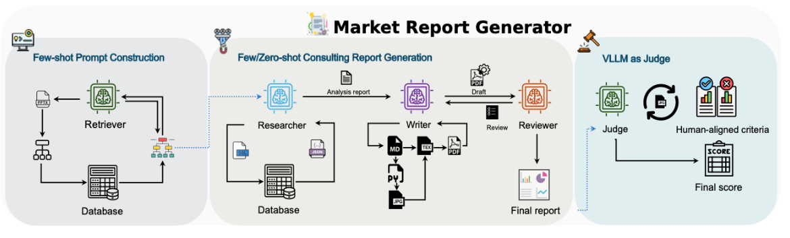
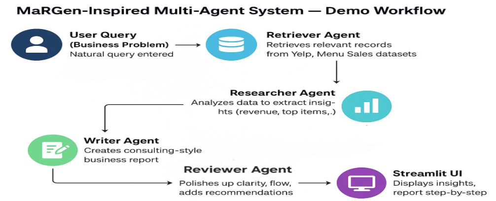
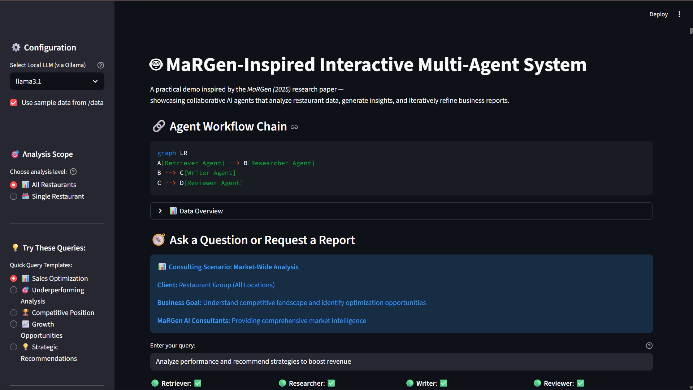
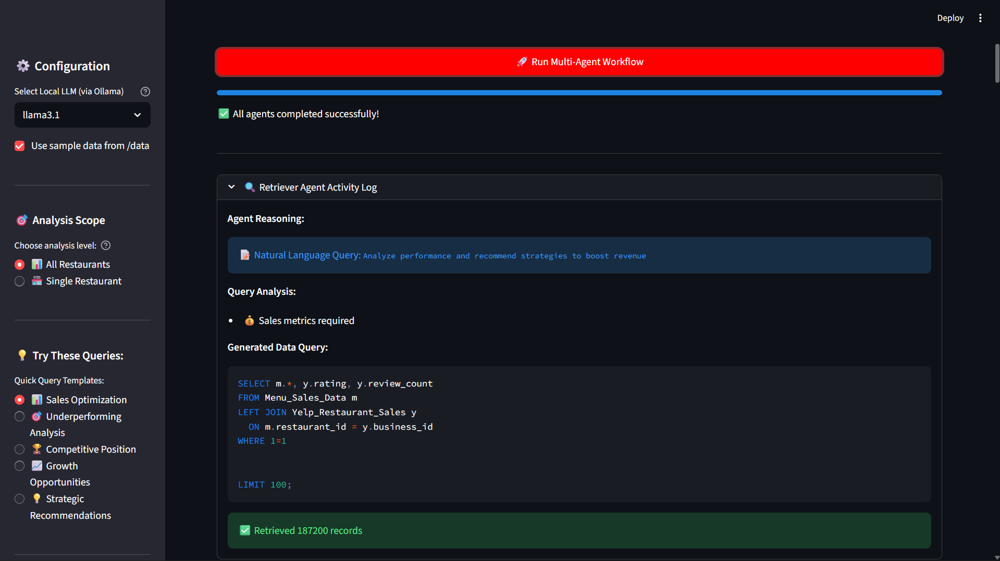
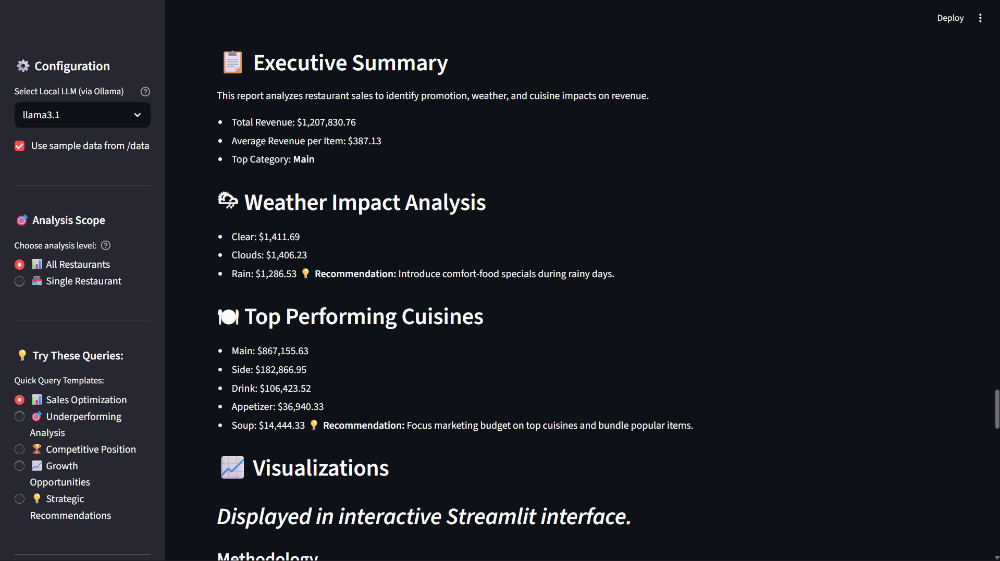

# 🍽️ LocalEats AI: Multi-Agent Restaurant Market Analysis

**Technologies:** Python • LangChain • Ollama • Streamlit • Pandas

A MaRGen-inspired multi-agent system that automates restaurant market research and sales optimization through collaborative LLM agents, reducing days of analyst work to minutes.

---

## 👥 Team Members (Team 4)

| Name | Role |
|------|------|
| **Vaibhavi Shinde** | Research, Presentation & Model Building |
| **Deepak Reddy** | Model Building + Demo Integration |
| **Ganesh Paparaju** | Agent Pipeline + UI Development |

---

## 📌 Project Overview

This project demonstrates practical implementation of the MaRGen (Market Report Generator) research framework:

- **Automated data retrieval** using a specialized Retriever agent
- **Business intelligence analysis** through a Researcher agent computing metrics and trends
- **Executive report generation** via a Writer agent producing consulting-style outputs
- **Iterative refinement** using a Reviewer agent for clarity and strategic depth

Traditional market research is slow, expensive, and human-intensive. This system automates the full workflow through specialized AI agents that collaborate like a consulting team.

---

## 🧠 System Architecture

### MaRGen Research Framework
The original MaRGen architecture from the Amazon Science paper:



### LocalEats AI Implementation
Our practical implementation adapting the MaRGen framework for restaurant analytics:



### Agent Workflow
```
User Query (Business Problem)
         ↓
[Retriever Agent] → Retrieves relevant records from Yelp & Menu Sales datasets
         ↓
[Researcher Agent] → Analyzes data to extract insights (revenue, top items, trends)
         ↓
[Writer Agent] → Creates consulting-style business report with recommendations
         ↓
[Reviewer Agent] → Polishes clarity, flow, and adds strategic recommendations
         ↓
[Streamlit UI] → Displays insights, reports step-by-step
```

---

## 👥 Multi-Agent Design

| Agent | Responsibility |
|-------|---------------|
| **Retriever** | Parses user intent and retrieves relevant restaurant & sales data |
| **Researcher** | Computes aggregates, trends, and performance metrics |
| **Writer** | Produces consulting-style business reports |
| **Reviewer** | Improves structure, clarity, and strategic depth |

Each agent operates independently yet contributes to a shared reasoning pipeline, following the MaRGen paper's collaborative design principles.

---

## 🖥️ Application Screenshots

### Home & Workflow Overview


### Data-Grounded Reasoning (Retriever Agent)


### Executive-Level Business Output


### Example Analytical Output


**Note:** Additional charts are generated dynamically during runtime but excluded from version control for repository conciseness.

---

## 🗂️ Dataset
```
data/
├── Hybrid_Yelp_Restaurant_Sales.csv  # Restaurant ratings, reviews, locations
└── Menu_Sales_Data.csv               # Menu items, revenue, categories, dates
```

**Dataset Statistics:**
- **3,600 Yelp reviews** across 15 restaurants
- **3,120 menu transactions** with sales data
- Multiple cuisine categories and price points

---

## 📈 Example Use Cases

1. **"Which menu categories are underperforming in sales and provide recommendations to improve performance?"**
2. **"Analyze revenue trends across different cuisines and suggest optimization strategies."**
3. **"Identify top-performing restaurants and extract success factors."**

---

## 🚀 Running the Application

### 1️⃣ Create Virtual Environment (Recommended)
```bash
python -m venv .venv
source .venv/bin/activate     # Mac/Linux
.venv\Scripts\activate        # Windows
```

### 2️⃣ Install Dependencies
```bash
pip install -r requirements.txt
```

### 3️⃣ Install Ollama & Pull Model
```bash
ollama pull llama3.1
```

**Note:** You can switch models directly from the Streamlit sidebar.

### 4️⃣ Launch Streamlit App
```bash
streamlit run app.py
```

The application will open at `http://localhost:8501`

---

## 📁 Repository Structure
```
MaRGen_Demo/
├── agents/
│   ├── retriever.py          # Data retrieval agent
│   ├── researcher.py         # Analytics agent
│   ├── writer.py             # Report generation agent
│   └── reviewer.py           # Quality refinement agent
├── data/
│   ├── Hybrid_Yelp_Restaurant_Sales.csv
│   └── Menu_Sales_Data.csv
├── docs/
│   ├── architecture/
│   │   ├── margen_paper_architecture.png
│   │   └── localeets_agent_flow.png
│   ├── screenshots/          # Application interface captures
│   └── charts/               # Sample visualizations
├── outputs/                  # Runtime-generated (gitignored)
├── app.py                    # Streamlit application
├── main.py                   # Agent orchestration logic
├── requirements.txt
└── README.md
```

---

## 💡 Key Features

This project demonstrates:

- ✅ **Automated Data Retrieval** – Intelligent agent queries datasets based on user questions
- ✅ **Multi-Dimensional Analysis** – Revenue trends, top performers, category insights
- ✅ **Professional Reports** – Consulting-style markdown reports with executive summaries
- ✅ **Iterative Refinement** – Reviewer agent improves clarity and actionability
- ✅ **Visual Insights** – Automated chart generation for key metrics
- ✅ **Interactive UI** – Exportable outputs (Markdown, CSV, JSON)

---

## 🔬 Research Foundation

**Based on:** MaRGen (Market Report Generator) - Amazon Science, 2025

**Key Research Findings:**
- Multi-agent collaboration reaches 10/10 quality scores in 3-4 refinement rounds
- LLM-as-judge evaluation correlates strongly with human experts (r=0.6, p<0.01)
- Cost-effective analysis: ~$1 per 6-page report, ~7 minutes generation time
- Iterative quality improvement through specialized agent roles

This project translates research concepts into a practical, end-to-end demonstration system.

---

## 🛠️ Technology Stack

| Component | Technology |
|-----------|-----------|
| LLM Framework | LangChain |
| Local LLM Runtime | Ollama (llama3.1 / mistral / qwen) |
| Cloud LLM | Snowflake Cortex (claude-3-5-sonnet) |
| Application Interface | Streamlit |
| Data Processing | Pandas, NumPy |
| Visualization | Matplotlib, Seaborn |
| Environment | Python 3.11+ |

---

## 🎓 Academic Context

- **Course:** DAMG 7374-02 - Data Engineering: Impact of Generative AI with LLM's
- **Institution:** Northeastern University
- **Semester:** Fall 2024

---

## 🚀 Future Enhancements

**Planned Improvements:**
- Integration with real-time data pipelines (Snowflake/APIs)
- Agent memory for cross-query learning
- Domain-specific agents (pricing strategy, promotions, geographic expansion)
- Deploy as interactive consulting assistant
- Expand to other industries (retail, e-commerce)

---

## 💡 Key Takeaways

This project demonstrates:

- ✅ Practical implementation of cutting-edge AI research (MaRGen framework)
- ✅ Building production-grade multi-agent systems with clear responsibilities
- ✅ Data-grounded business intelligence automation
- ✅ Local LLM deployment for cost-effective AI applications
- ✅ Interactive application development with modern Python frameworks

**Ideal for:** ML Engineer, AI Engineer, Data Scientist roles focusing on GenAI applications and agentic systems.

---

## 📧 Contact

**Ganesh Paparaju** | [LinkedIn](https://www.linkedin.com/in/ganeshpaparaju) | [Email](mailto:paparaju.s@northeastern.edu)

*This project showcases practical GenAI engineering skills and is available for technical discussion.*

---

## 🙏 Acknowledgments

Special thanks to the Amazon Science team for the MaRGen research paper that inspired this implementation.

---

## 📄 License

This project is for educational purposes as part of coursework at Northeastern University.
